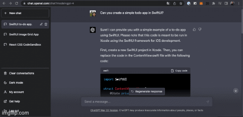

# TODOLIST SWIFTUI CHATGPT 👋

A todo list in SwiftUI with the help of ChatGPT4 [ChatGPT and iOS App Developement— The Buzzword of 2023](https://medium.com/canopas/chatgpt-and-ios-app-developement-the-buzzword-of-2023-c6aa54bfd26d)

  
  
     Todo App in SwiftUI with ChatGPT
      
    <a href="#">
    
    
  
   
     
    <a href="https://github.com/brenfondeadora/TodoList_SwiftUI_ChatGPT/issues/new">Report bug</a>
    ·
    <a href="https://github.com/brenfondeadora/TodoList_SwiftUI_ChatGPT/issues/new">Request feature</a>

 

## 🤖 Requirements

- Have an account plus on [chatgpt](https://chat.openai.com/) to use chatgpt4

## 👤 Author

**Brenda Saavedra**

- WebPage: [brendasaavedra.com](http://brendasaavedra.com)
- Github: [@brenfondeadora](https://github.com/brenfondeadora/)
